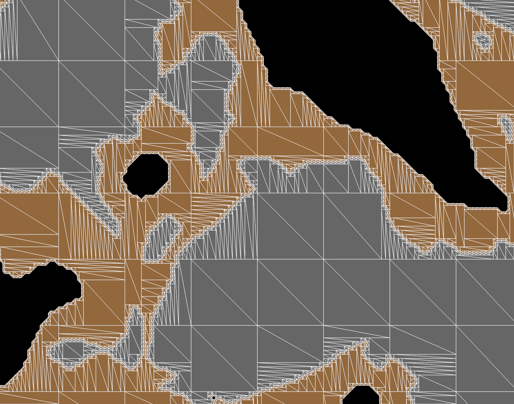

<div align="center" id="top"> 
  

  &#xa0;

  <!-- <a href="https://planet-game.netlify.app">Demo</a> -->
</div>

<h1 align="center">Planet Game</h1>

<p align="center">
  

  

  

  

  <!--  -->

  <!--  -->

  <!--  -->
</p>

<!-- Status -->

<!-- <h4 align="center"> 
	🚧  planet-game 🚀 Under construction...  🚧
</h4> 

<hr> -->

<p align="center">
  <a href="#dart-about">About</a> &#xa0; | &#xa0; 
  <a href="#sparkles-features">Features</a> &#xa0; | &#xa0;
  <a href="#rocket-technologies">Technologies</a> &#xa0; | &#xa0;
  <a href="#white_check_mark-requirements">Requirements</a> &#xa0; | &#xa0;
  <a href="#checkered_flag-starting">Starting</a> &#xa0; | &#xa0;
  <a href="#memo-license">License</a> &#xa0; | &#xa0;
  <a href="https://github.com/aaronkanaron" target="_blank">Author</a>
</p>

<br>

## :dart: About ##

Planet Game is a 2D voxel-based terrain generation and editing game built with Rust and the Bevy game engine. The game features procedural terrain generation using Perlin noise, creating seamless worlds with different materials like rock, dirt, and air. Players can interact with the terrain by digging and modifying the voxel world in real-time.

The project demonstrates advanced techniques in:
- Procedural terrain generation using multi-octave Perlin noise
- Seamless chunk-based world loading
- Real-time mesh generation and optimization
- Dual contouring and greedy meshing algorithms
- Interactive voxel manipulation

## :sparkles: Features ##

:heavy_check_mark: **Procedural Terrain Generation** - Multi-layered Perlin noise creates realistic, varied landscapes;\
:heavy_check_mark: **Seamless Chunk System** - Infinite world generation with smooth chunk boundaries;\
:heavy_check_mark: **Real-time Voxel Editing** - Click to dig and modify terrain with immediate visual feedback;\
:heavy_check_mark: **Optimized Rendering** - Dual contouring and greedy meshing for efficient 2D mesh generation;\
:heavy_check_mark: **Multiple Material Types** - Rock, dirt, and air with smooth transitions;\
:heavy_check_mark: **Interactive Camera** - 2D camera system for exploring the generated world;

## :rocket: Technologies ##

The following tools and libraries were used in this project:

- [Rust](https://www.rust-lang.org/) - Systems programming language for performance and safety
- [Bevy](https://bevyengine.org/) - Modern game engine built in Rust
- [noise-rs](https://github.com/Razaekel/noise-rs) - Procedural noise generation library
- [nalgebra](https://nalgebra.org/) - Linear algebra library for 3D mathematics
- [once_cell](https://github.com/matklad/once_cell) - Single-assignment cells for lazy static initialization

## :white_check_mark: Requirements ##

Before starting :checkered_flag:, you need to have [Git](https://git-scm.com) and [Rust](https://rustup.rs/) installed.

## :checkered_flag: Starting ##

```bash
# Clone this project
$ git clone https://github.com/aaronkanaron/planet-game

# Access the project directory
$ cd planet-game

# Build the project
$ cargo build

# Run the game
$ cargo run

# For optimized release build
$ cargo run --release
```

### Controls

- **Left Mouse Button**: Dig terrain (removes voxels in a small area)
- **Mouse Movement**: Observe the procedurally generated terrain

### Project Structure

```
src/
├── main.rs              # Main game loop and input handling
├── planet/
│   ├── plugin.rs        # Bevy plugin for planet systems
│   ├── startup.rs       # Chunk generation and voxel world management
│   ├── mesh.rs          # Dual contouring mesh generation
│   └── greedy_mesh.rs   # Greedy meshing optimization
```

## :memo: License ##

This project is under license from MIT. For more details, see the [LICENSE](LICENSE.md) file.


Made with :heart: by <a href="https://github.com/aaronkanaron" target="_blank">Aaron Clauss</a>

&#xa0;

<a href="#top">Back to top</a>
