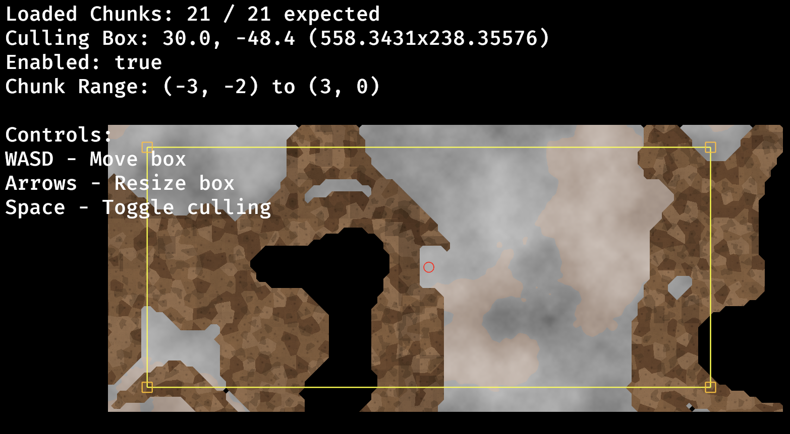

<div align="center" id="top"> 
  

  &#xa0;

  <!-- <a href="https://planet-game.netlify.app">Demo</a> -->
</div>

<h1 align="center">Planet Game</h1>

<p align="center">
  

  

  

  
</p>

### Setup
Install pre-commit:
```bash
pip install pre-commit
```

Then run:
```bash
sh setup.sh
```
